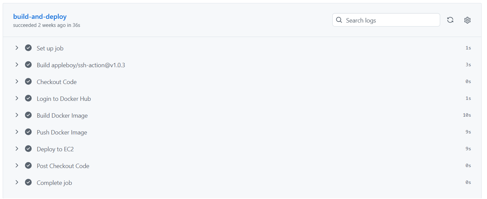
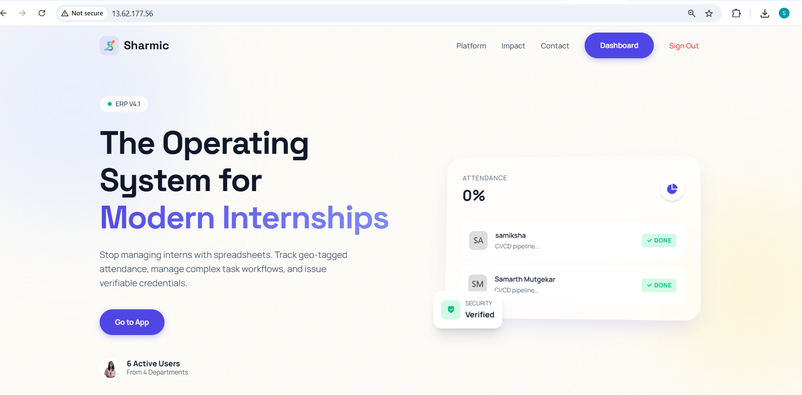
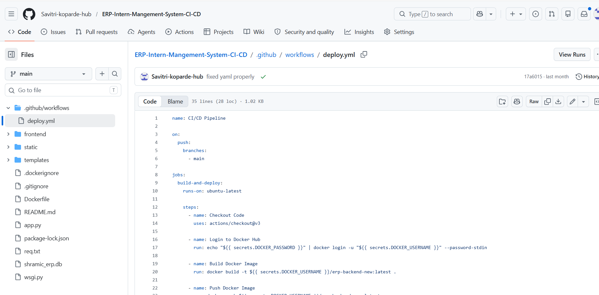
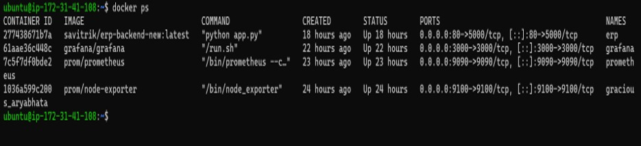
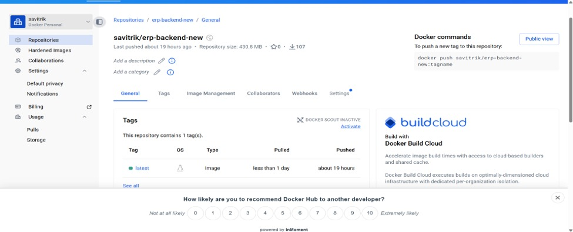
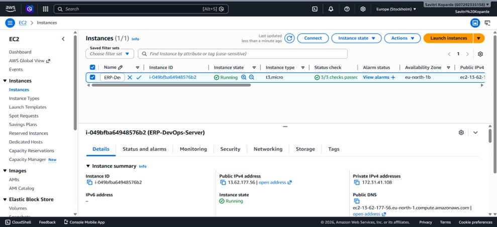
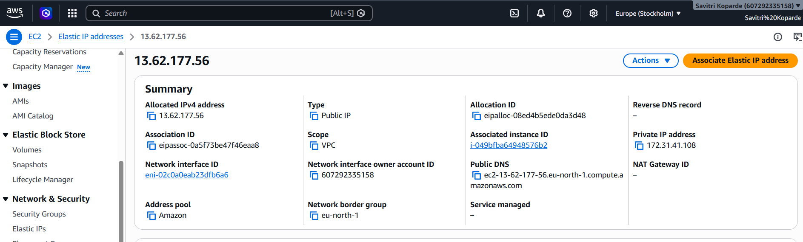
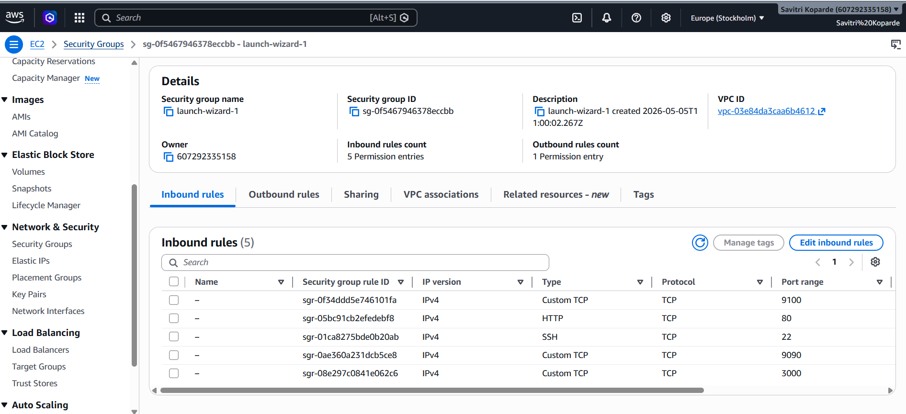
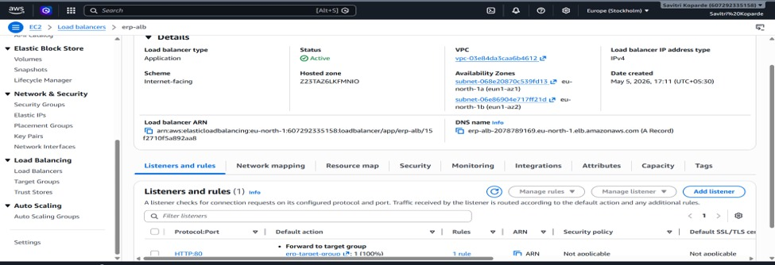
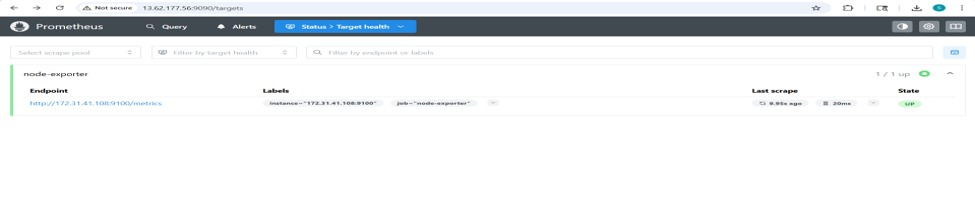

# ERP Intern Management System with DevOps Implementation

> A complete ERP Intern Management System integrated with modern DevOps practices including CI/CD, Docker, AWS Cloud deployment, Infrastructure Monitoring, and Automated Deployment.

---

# Project Overview

This project is a web-based ERP Intern Management System developed using Flask and SQLite. The application simplifies intern management by providing modules for registration, attendance tracking, task management, document verification, and role-based dashboards for administrators and interns.

To make the application production-ready, a complete DevOps workflow was implemented. The project demonstrates Continuous Integration, Continuous Deployment (CI/CD), containerization, cloud deployment, infrastructure monitoring, and automated application delivery.

---

# Features

### ERP Features

- Secure User Authentication
- Admin Dashboard
- Intern Dashboard
- Attendance Management
- Task Assignment
- Document Upload & Verification
- Role-Based Access Control
- SQLite Database

---

### DevOps Features

- Git Version Control
- GitHub Repository
- GitHub Actions CI/CD
- Docker Containerization
- Docker Hub Integration
- AWS EC2 Deployment
- Elastic IP Configuration
- Security Group Configuration
- Prometheus Monitoring
- Grafana Dashboards
- Node Exporter Metrics
- Docker Restart Policy
- Infrastructure Monitoring

---

# Tech Stack

| Category | Technologies |
|-----------|-------------|
| Backend | Python, Flask |
| Frontend | HTML, CSS, JavaScript |
| Database | SQLite |
| Version Control | Git, GitHub |
| CI/CD | GitHub Actions |
| Containerization | Docker, Docker Compose |
| Registry | Docker Hub |
| Cloud | AWS EC2 |
| Monitoring | Prometheus, Grafana, Node Exporter |

---

# 🔄 DevOps Workflow

Developer

↓

GitHub Repository

↓

GitHub Actions

↓

Docker Build

↓

Docker Hub

↓

AWS EC2

↓

ERP Application

↓

Prometheus

↓

Grafana Dashboard

---
# CI/CD FLOW

---

# 📷 Application Screenshot

## Home Page

---

# ⚙️ CI/CD Pipeline

Whenever code is pushed to GitHub:

- GitHub Actions automatically starts
- Docker image is built
- Image is pushed to Docker Hub
- EC2 server pulls latest image
- Old container is removed
- New container starts automatically

---

## GitHub Actions

---

# 🐳 Docker Implementation

The application is containerized using Docker.

Services:

- ERP Application
- Prometheus
- Grafana
- Node Exporter

---

## Docker Containers

---

## Docker Hub

---

# ☁️ AWS Deployment

The application is hosted on AWS EC2 Ubuntu Server.

Infrastructure includes:

- EC2 Instance
- Elastic IP
- Security Groups
- Docker Deployment

---

## EC2

---

## Elastic IP

---

## Security Group

---

# 📊 Monitoring

Prometheus collects infrastructure metrics.

Node Exporter exposes system metrics.

Grafana visualizes them through dashboards.

---

## Grafana Dashboard

---

## Prometheus Targets

---

# 🚨 Alerting

Grafana alert rules were configured for:

- High CPU Usage
- High Memory Usage
- High Disk Usage

Alerts help administrators identify infrastructure issues before they affect application availability.

---

# 📈 Future Enhancements

- Kubernetes Deployment
- Auto Scaling
- Terraform Infrastructure
- Jenkins Pipeline
- Email Alerting
- SSL (HTTPS)
- RDS Database
- CloudWatch Monitoring

---

# 👩‍💻 Author

**Savitri Koparde**

DevOps Engineer
